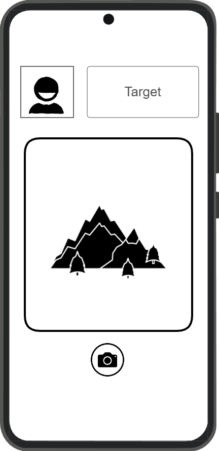

# Photogenic

[My Notes](notes.md)
Photo tag or TTRGP sheet???

My application will be called Photogenic. It is a multiplayer game based around taking photos. There are multiple game modes that require you to take photos of your friends or objects given to you in a prompt. Every game involves uploading a photo of yourself in order to play. One game is assassins, which involves each player recieving an assigned target. The objective is to take a picture of your target, eliminating them from the game. The other game is a murder mystery wich involves one chosen person trying to take photos of the other participants, while the rest try to finish a scavengerhunt before they are all eliminated.

## 🚀 Specification Deliverable

For this deliverable I did the following. I checked the box `[x]` and added a description for things I completed.

- [X] Proper use of Markdown
- [X] A concise and compelling elevator pitch
- [X] Description of key features
- [X] Description of how you will use each technology
- [X] One or more rough sketches of your application. Images must be embedded in this file using Markdown image references.

### Elevator pitch

If you need fun free thing to do with your college buddies, look no further. Photogenic is quick way for you and your friends to play imersive games, while out and about. The best part is that you only need your phone! Just upload a picture of yourself and let the fun commence. Sneak around and search for a chance to take a photo of you target in the assassin game, or use your deductive skills to find the traitor in the murder mystery mode. Careful not to get your picture taken! Once someone grabs a good photo of you, the app will let everyone know that you have been eliminated. Fun with friends is now easier than ever.

### Design

Here are sketches of what the lobby people join will look like, as well as the photo page after the game starts.

 

### Key features

- Creation of joinable groups for games
- Connection to the camera for photo upload
- Connection to an API with image regonition capabilities
- Live updates on in game eliminations

### Technologies

I am going to use the required technologies in the following ways.

- **HTML** - Forming the page struture for the sign in, lobby, gameplay, and end of game pages.
- **CSS** - Decorative elements matching the games theme. Both darkening the display and adapting it to a phone.
- **React** - React will be used for the buttons to set up the game as well as the sign in.
- **Service** - The service will include analyzing photos though a connection to an api, as well as the mechanics of the game.
- **DB/Login** - This is where account info will be stored, as well as temporary photos for the game.
- **WebSocket** - When a photo is succesfully taken the person eliminated will be displayed

## 🚀 AWS deliverable

For this deliverable I did the following. I checked the box `[x]` and added a description for things I completed.

- [X] **Server deployed and accessible with custom domain name** - [My server link](https://yourdomainnamehere.click).

## 🚀 HTML deliverable

For this deliverable I did the following. I checked the box `[x]` and added a description for things I completed.

- [X] **HTML pages** - I created 4 pages (the inital lobby, the gameplaypage, the end game page, and a sign in page).
- [X] **Proper HTML element usage** - I headers on each relevant page and organized my pages using the body and div tags. I left a footer open should I decivde i need it later.
- [X] **Links** - I added temporary links with a note to remove them later.
- [X] **Text** - I included the text that prompts the user to navigate the platform.
- [X] **3rd party API placeholder** - I added a section that will be covered by the camera. When the button next to it is pressed it will send off the photo for processsing.
- [X] **Images** - I added images that will be replaced by the photos taken.
- [X] **Login placeholder** - I added a link that will take you to the sign in page and later display the user name.
- [X] **DB data placeholder** - I added place holder images that will be replace by the players photos store in the data base to summarize the game.
- [X] **WebSocket placeholder** - The feed is going to be where peole get live updates about their game.

## 🚀 CSS deliverable

For this deliverable I did the following. I checked the box `[x]` and added a description for things I completed.

- [ ] **Visually appealing colors and layout. No overflowing elements.** - I did not complete this part of the deliverable.
- [ ] **Use of a CSS framework** - I did not complete this part of the deliverable.
- [ ] **All visual elements styled using CSS** - I did not complete this part of the deliverable.
- [ ] **Responsive to window resizing using flexbox and/or grid display** - I did not complete this part of the deliverable.
- [ ] **Use of a imported font** - I did not complete this part of the deliverable.
- [ ] **Use of different types of selectors including element, class, ID, and pseudo selectors** - I did not complete this part of the deliverable.

## 🚀 React part 1: Routing deliverable

For this deliverable I did the following. I checked the box `[x]` and added a description for things I completed.

- [ ] **Bundled using Vite** - I did not complete this part of the deliverable.
- [ ] **Components** - I did not complete this part of the deliverable.
- [ ] **Router** - I did not complete this part of the deliverable.

## 🚀 React part 2: Reactivity deliverable

For this deliverable I did the following. I checked the box `[x]` and added a description for things I completed.

- [ ] **All functionality implemented or mocked out** - I did not complete this part of the deliverable.
- [ ] **Hooks** - I did not complete this part of the deliverable.

## 🚀 Service deliverable

For this deliverable I did the following. I checked the box `[x]` and added a description for things I completed.

- [ ] **Node.js/Express HTTP service** - I did not complete this part of the deliverable.
- [ ] **Static middleware for frontend** - I did not complete this part of the deliverable.
- [ ] **Calls to third party endpoints** - I did not complete this part of the deliverable.
- [ ] **Backend service endpoints** - I did not complete this part of the deliverable.
- [ ] **Frontend calls service endpoints** - I did not complete this part of the deliverable.
- [ ] **Supports registration, login, logout, and restricted endpoint** - I did not complete this part of the deliverable.

## 🚀 DB deliverable

For this deliverable I did the following. I checked the box `[x]` and added a description for things I completed.

- [ ] **Stores data in MongoDB** - I did not complete this part of the deliverable.
- [ ] **Stores credentials in MongoDB** - I did not complete this part of the deliverable.

## 🚀 WebSocket deliverable

For this deliverable I did the following. I checked the box `[x]` and added a description for things I completed.

- [ ] **Backend listens for WebSocket connection** - I did not complete this part of the deliverable.
- [ ] **Frontend makes WebSocket connection** - I did not complete this part of the deliverable.
- [ ] **Data sent over WebSocket connection** - I did not complete this part of the deliverable.
- [ ] **WebSocket data displayed** - I did not complete this part of the deliverable.
- [ ] **Application is fully functional** - I did not complete this part of the deliverable.
